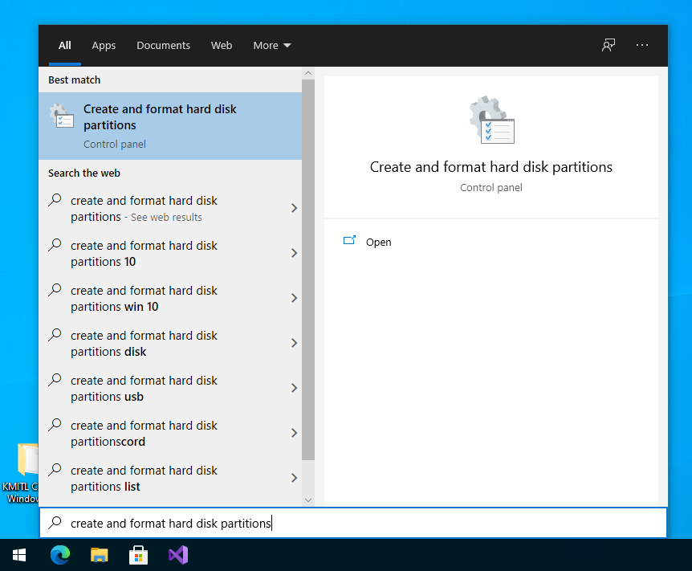
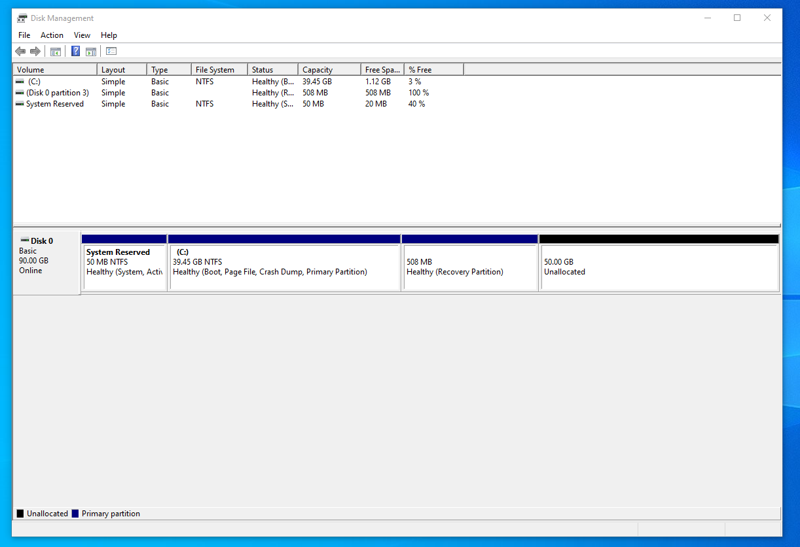
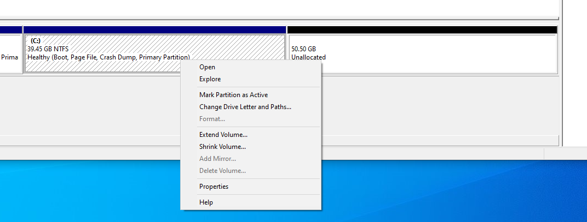
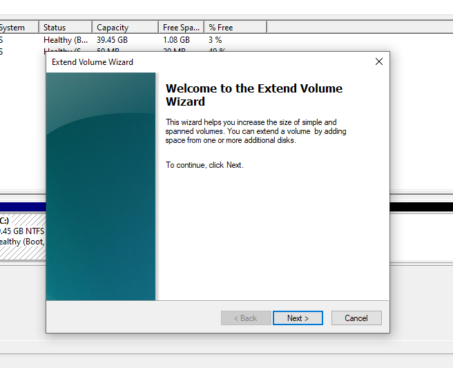
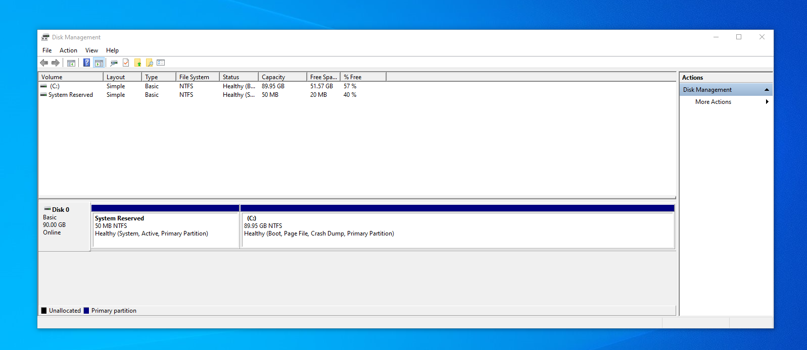

## วิธีขยาย/เพิ่มขนาด (KVM) Virtual Machine disk ของ Windows 10 บน Linux

### ขั้นตอนที่ 1:  ปิด Virtual Machine บน KVM

ก่อนที่จะขยาย/เพิ่มขนาด disk ต้องปิด Virtual Machine ก่อน

``` console
$ sudo virsh list
  Id   Name         State
 ----------------------------
  4    windows-10   running
```

ถ้า Guest Machine ยังทำงานอยู่ ให้ปิดโดยใช้ Id หรือ Name ของมัน

``` console
$ sudo virsh shutdown windows-10
 Domain 'windows-10' is being shutdown
```

เช็คอีกรอบให้แน่ใจก่อนจะจัดการกับ disk ของมัน

``` console
$ sudo virsh list
  Id   Name         State
 ----------------------------
```

### ขั้นตอนที่ 2 : ตามหา Path ของ KVM guest OS disk

หา Path ของ Guest OS disk

``` console
$ sudo virsh domblklist windows-10
 Target   Source
----------------------------------------------------
 sda      /var/lib/libvirt/images/windows-10.qcow2
```

คุณสามารถหาข้อมูลนี้ได้จาก Virtual Machine Manager GUI ได้เช่นกัน

Path ของ Guest OS disk ผมอยู่ที่ `/var/lib/libvirt/images/windows-10`

มาดูข้อมูลของ Guest OS disk กัน

``` console
$ sudo qemu-img info /var/lib/libvirt/images/windows-10.qcow2
 image: /var/lib/libvirt/images/windows-10.qcow2
 file format: qcow2
 virtual size: 40 GiB (42949672960 bytes)
 disk size: 32.3 GiB
 cluster_size: 65536
 Format specific information:
     compat: 1.1
     compression type: zlib
     lazy refcounts: true
     refcount bits: 16
     corrupt: false
     extended l2: false
```

### ขั้นตอนที่ 3 : ขยาย/เพิ่มขนาด KVM Guest OS disk

เมื่อเรารู้ Path Virtual Machine disk ของเราแล้ว มาขยายให้เป็นขนาดที่เราต้องการกัน

โดยเราจะใช้เครื่องหมาย `"+"` ไว้ข้างหน้าขนาดที่เราต้องการเพิ่ม

``` console
$ sudo qemu-img resize /var/lib/libvirt/images/windows-10.qcow2 +50G
 Image resized.
```

### ขั้นตอนที่ 4 : ตรวจสอบ Partition ใน Windows 10

คราวนี้ให้เริ่มการทำงาน VM

``` console
$ sudo virsh start windows-10
 Domain 'windows-10' started.
```

เข้าไปที่ Windows 10 ใน KVM จากนั้นเปิด Start Menu แล้วพิมพ์ `'Create and format hard disk partitions'` แล้วเลือกเปิดอันแรก



จากนั้นจะเห็นว่าพื้นที่ใหม่ที่เราได้เพิ่มมาเขียนว่า `'50.00 GB Unallocated'`

ให้เช็คว่ามี Partition อื่นขวาง Partition ที่เราต้องการขยายไปยังพื้นที่ว่างใหม่หรือไม่

ของผมจะมีที่มาขวางคือ `'500 MB Healthy (Recovery Parition)'` ซึ่งเป็น Partition ที่ไม่สำคัญมาก จึงให้ทำการลบในขั้นตอนต่อไป

ถ้าหากไม่พบ Partition ที่ขวางพื้นที่ว่างให้ข้ามไปขั้นตอนที่ 6 ได้เลย [ขั้นตอนที่ 6](###ขั้นตอนที่-6-:-ขยาย-partition-ที่ต้องการไปยังพื้นที่ว่างใหม่)



### ขั้นตอนที่ 5 : ลบ Partition ที่ขวางอยู่

เปิด Start Menu แล้วพิมพ์ `'cmd'` แล้วเลือกเปิดอันแรก

จากนั้นพิมพ์คำสั่ง diskpart เพื่อใช้งาน โปรแกรม DiskPart

``` console
$ diskpart
```

เมื่อเข้ามาใน DiskPart เราจะมาดู Disk ที่มีทั้งหมด

``` console
$ list disk
 Disk ###  Status         Size     Free     Dyn  Gpt
 --------  -------------  -------  -------  ---  ---
 Disk 0    Online           90 GB
```

จะเห็นว่า ของผมจะมี `'Disk 0'` ผมจึงจะเลือก Disk 0 โดยเลือกจาก Id คือ 0

``` console
$ select disk 0
 Disk 0 is now the selected disk.
```

จากนั้นเราจะมาดู Partition ที่มีทั้งหมดใน Disk

``` console
$ list partition
 Partition ###  Type             Size     Offset
 -------------  ---------------- -------  -------
 Partition 1    Primary            50 MB  1024 KB
 Partition 2    Primary            39 GB    51 MB
 Partition 3    Recovery          508 MB    39 GB
```

จะเห็นได้ว่า Partition ที่ขวางอยู่ ชื่อว่า `'Recovery'` ผมจึงเลือกจาก Id คือ 3

``` console
$ select partition 3
 Partition 3 is now the selected partition.
```

จากนั้นเราก็ลบ Partition ที่เราเลือกได้เลย

``` console
$ delete partition override
 DiskPart successfully deleted the selected partition.
```

เมื่อลบเสร็จจะทำให้เราสามารถขยาย Partition ที่เราต้องการ ของผมคือ Partition (C:) นั่นเอง ซึ่งตอนแรกมี Partition ขวางอยู่จึงไม่ขยายไปยังพื้นที่ว่างใหม่ได้

### ขั้นตอนที่ 6 : ขยาย Partition ที่ต้องการไปยังพื้นที่ว่างใหม่

เมื่อ Partition ที่เราต้องการขยายไม่มีอะไรขวางแล้ว เราก็สามารถขยาย Partition ไปยังพื้นที่ใหม่ได้เลย 

โดยคลิ๊กขวาที่ Partition ที่เราต้องการขยาย แล้วเลือก `'Extend Volume...'` ปกติแล้วถ้ามี Partition ขวางอยู่ทางขวา ตัวเลือกนี้จะไม่สามารถเลือกได้



จากนั้น Windows จะเปิด Extend Volume Wizard มา ให้กด Next เพื่อจัดการขยาย Partition ได้เลย



จากนั้นเราก็จะได้พื้นที่บน Partition ที่ขยายเสร็จเรียบร้อย

